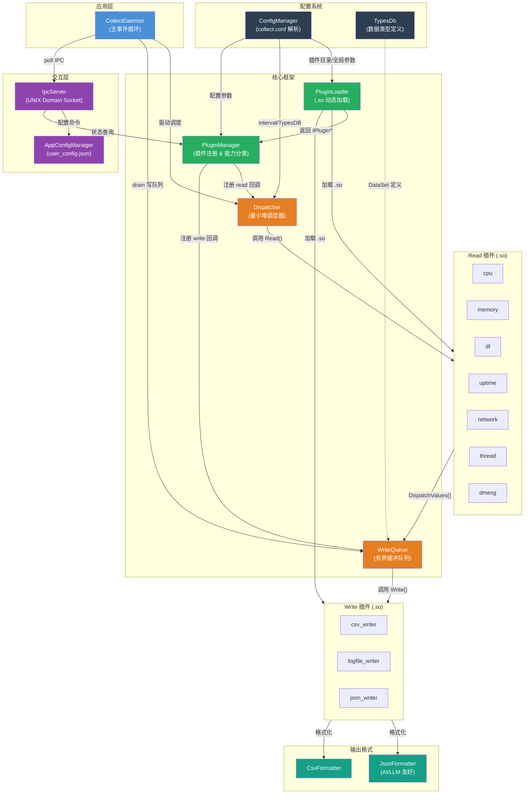
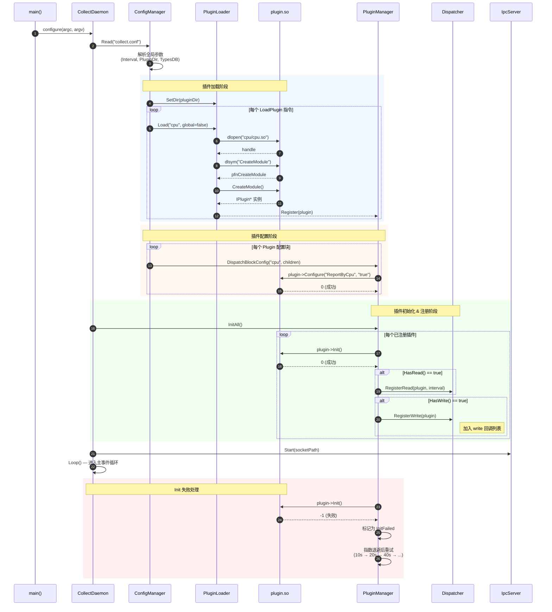
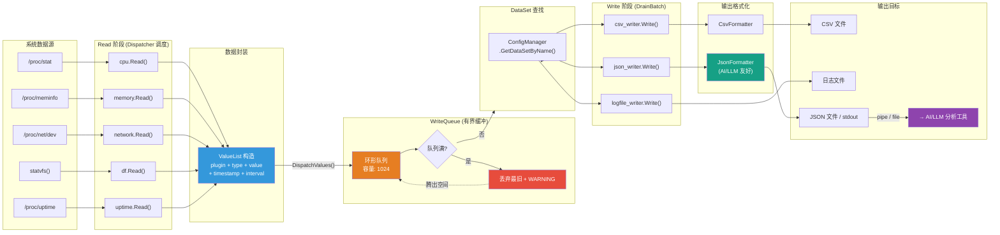

# 🏗️ Collect 系统架构设计

> 本文档包含系统的组件关系、插件加载时序和核心数据流的可视化设计。

---

## 一、组件图 (Component Diagram)

展示 `PluginManager`、`ConfigManager`、`WriteQueue`（DataBus）和各类插件的依赖关系。



**组件职责说明**：

| 颜色 | 层级     | 组件                        |
| ---- | -------- | --------------------------- |
| 🔵 蓝 | 应用层   | CollectDaemon               |
| 🟠 橙 | 调度层   | Dispatcher, WriteQueue      |
| 🟢 绿 | 插件管理 | PluginManager, PluginLoader |
| 🟣 紫 | 交互层   | IpcServer, AppConfigManager |
| ⚫ 深 | 配置层   | ConfigManager, TypesDb      |
| 🟩 青 | 输出格式 | JsonFormatter, CsvFormatter |

---

## 二、插件加载时序图 (Sequence Diagram)

展示系统启动时如何通过动态库 (`.so`) 加载插件、配置并初始化。



---

## 三、核心数据流图

展示指标从 Read 插件采集 → WriteQueue 缓冲 → Write 插件输出的完整路径。



**数据流关键路径**：

```
/proc/stat → cpu.Read() → ValueList{plugin:"cpu", type:"percent", value:23.5}
    → WriteQueue.enqueue()
    → [主循环 DrainBatch]
    → csv_writer.Write(ds, vl)   → CSV 文件
    → json_writer.Write(ds, vl)  → JsonFormatter → {"plugin":"cpu","value":23.5,...}
                                                   → stdout → AI/LLM 工具
```
