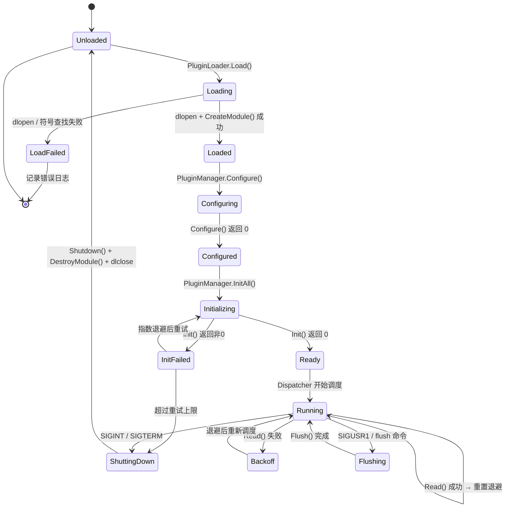

# 📦 Collect 监控系统产品需求文档 (PRD)

> **版本**: v2.0 | **更新日期**: 2026-02-15
> **变更说明**: 基于重构设计讨论，明确插件生命周期、单线程调度模型、App 交互与 AI/LLM 输出。

---

## 一、项目目标

构建一个运行在嵌入式 Linux 系统上的轻量级系统资源监控模块，采用 C++14 编写，具备如下特性：

* **模块解耦**：各功能单元职责清晰，通过依赖注入组合，易于扩展与测试。
* **插件化架构**：支持动态加载 `.so` 插件，采集 CPU、内存、磁盘等指标。
* **高效单线程**：基于最小堆的事件驱动调度，数据采集与输出在同一事件循环中交替执行，无多线程开销。
* **配置驱动**：通过 `collect.conf` 启用/禁用插件与功能参数。
* **App 交互**：通过 UNIX Domain Socket 与 App 进程双向通信，实时管理配置。
* **AI/LLM 友好输出**：支持结构化 JSON 输出格式，可直接供大模型或分析工具消费。

---

## 二、系统架构设计

### 1. 核心模块划分

| 模块名             | 职责说明                                             |
| ------------------ | ---------------------------------------------------- |
| `ConfigManager`    | 解析 `collect.conf`，管理全局配置与 TypesDB          |
| `PluginManager`    | 插件注册、能力分类（read/write/flush）、生命周期管理 |
| `PluginLoader`     | 动态库 `.so` 加载/卸载，RAII 句柄管理                |
| `Dispatcher`       | 单线程最小堆调度器，管理各插件独立采集周期           |
| `WriteQueue`       | 有界缓冲队列，解耦采集与输出                         |
| `IpcServer`        | UNIX Domain Socket 服务端，处理 App 交互命令         |
| `AppConfigManager` | 管理 `user_config.json`，控制 App 模块配置           |
| `OutputFormatter`  | 数据格式化（JSON / CSV），支持 AI/LLM 消费           |

### 2. 设计约束

| 约束项        | 说明                                         |
| ------------- | -------------------------------------------- |
| 线程模型      | 🚫 不使用多线程 — 单线程事件循环 + 最小堆调度 |
| 构建系统      | CMake，目标 C++14                            |
| JSON 库       | cJSON（轻量 C 库，嵌入式友好）               |
| IPC 方式      | UNIX Domain Socket（替代文件+信号方案）      |
| 构建/测试环境 | Ubuntu VM 本地编译，后续交叉编译到嵌入式设备 |
| 测试框架      | Google Test (GTest)                          |

---

## 三、插件生命周期管理

### 1. 插件接口 (`IPlugin`)

每个插件实现 `IPlugin` 接口，并通过 **能力声明** 告知系统自身支持的功能：

| 方法          | 必须实现 | 说明                                    |
| ------------- | -------- | --------------------------------------- |
| `Name()`      | ✅        | 返回插件名称（如 `"cpu"`）              |
| `HasRead()`   | ✅        | 是否支持数据采集                        |
| `HasWrite()`  | ✅        | 是否支持数据写出                        |
| `HasFlush()`  | ✅        | 是否支持 flush 操作                     |
| `Configure()` | 可选     | 接收配置参数（如 `ReportByCpu = true`） |
| `Init()`      | 可选     | 初始化（打开文件句柄、连接、缓冲区等）  |
| `Read()`      | 可选     | 执行一次数据采集                        |
| `Write()`     | 可选     | 接收并写出一条 `ValueList`              |
| `Flush()`     | 可选     | 强制刷新缓冲数据到目标                  |
| `Shutdown()`  | 可选     | 清理资源（关闭文件、释放内存）          |

### 2. 插件类型分类

```
┌──────────────────────────────────────────────────┐
│               已加载插件池                        │
├─────────────┬─────────────┬──────────────────────┤
│ Read 插件   │ Write 插件  │ Flush 插件           │
│ HasRead()   │ HasWrite()  │ HasFlush()           │
├─────────────┼─────────────┼──────────────────────┤
│ cpu         │ csv_writer  │ csv_writer           │
│ memory      │ log_writer  │ log_writer           │
│ df          │ json_writer │ json_writer          │
│ uptime      │             │                      │
│ network     │             │                      │
│ thread      │             │                      │
│ dmesg       │             │                      │
└─────────────┴─────────────┴──────────────────────┘
```

> **关键设计**：`PluginManager` 在注册时根据 `HasRead()`/`HasWrite()`/`HasFlush()` 自动将插件归入对应列表，调度和分发时只遍历相关列表，避免广播风暴。

### 3. 插件生命周期状态机



### 4. 指数退避策略

| 参数         | 默认值     | 配置项            |
| ------------ | ---------- | ----------------- |
| 基础采集周期 | 插件配置值 | `Interval`        |
| 退避倍数     | 2×         | 固定              |
| 最大采集周期 | 86400s     | `MaxReadInterval` |

```
失败次数:  0    1    2    3    4    ...
实际周期: 10s  20s  40s  80s  160s  ...  → 最大 86400s
```

成功后立即恢复到基础周期。

---

## 四、调度与数据流

### 1. 主事件循环

单线程中交替执行三个动作：

```
┌─────────────────────────────────────────────────────────────┐
│                    主事件循环 (单线程)                        │
│                                                             │
│  ┌──────────┐    ┌──────────────┐    ┌───────────┐         │
│  │ 1. Read  │───▶│ 2. Write     │───▶│ 3. IPC    │──┐      │
│  │ (调度器) │    │ (写队列drain)│    │ (Socket)  │  │      │
│  └──────────┘    └──────────────┘    └───────────┘  │      │
│       ▲                                              │      │
│       └──────────── 4. WaitUntil(下次到期) ◀─────────┘      │
└─────────────────────────────────────────────────────────────┘
```

1. **Read 阶段**：`Dispatcher::RunOnce()` 检查最小堆，执行所有已到期插件的 `Read()` 回调。采集到的数据通过 `DispatchValues()` 投递到 `WriteQueue`。
2. **Write 阶段**：`WriteQueue::DrainBatch(N)` 最多处理 N 条数据，对每条调用所有 write 插件的 `Write()` 回调。
3. **IPC 阶段**：`IpcServer::Poll()` 非阻塞检查 UNIX socket，处理 App 发来的命令。
4. **等待**：`WaitUntil()` 休眠到下个 read 任务到期，或被信号唤醒。

### 2. Dispatcher 最小堆调度

```
最小堆 (按 nextRead 排序):
───────────────────────────────
│ cpu    │ nextRead = T+10s   │ ← 堆顶 (最早到期)
│ memory │ nextRead = T+15s   │
│ df     │ nextRead = T+30s   │
│ uptime │ nextRead = T+60s   │
───────────────────────────────

每轮 RunOnce():
  1. peek 堆顶 → 如果 nextRead <= now，执行 Read()
  2. 执行后更新 nextRead = now + currentInterval
  3. 重新堆化 (sift-down)
  4. 重复直到堆顶 nextRead > now
  5. 返回堆顶 nextRead 作为下次等待目标
```

### 3. WriteQueue 有界缓冲

```
         ┌──────────── 有界环形队列 (默认 1024) ────────────┐
 enqueue │ [VL₁] [VL₂] [VL₃] ... [VLₙ]                    │ drain
 ───────▶│                                                  │──────▶ Write 插件
         └──────────────────────────────────────────────────┘
                        ▲
                        │ 队列满时丢弃最旧 + WARNING 日志
```

---

## 五、功能性需求

### 1. 插件机制

* ✅ 插件通过 `.so` 动态加载，导出 `CreateModule()` / `DestroyModule()`
* ✅ 插件声明能力（`HasRead/HasWrite/HasFlush`），由 `PluginManager` 自动分类注册
* ✅ 每个 read 插件可定义独立采集周期（interval）
* ✅ 插件 `Read()` 失败时指数退避，成功后恢复
* ✅ 插件 `Read()` 超时记录告警日志
* ✅ 插件支持配置参数（如 CPU 插件 `ReportByCpu = true`）

### 2. 支持的 Read 插件

| 插件      | 数据源          | 采集字段                                                                 |
| --------- | --------------- | ------------------------------------------------------------------------ |
| `cpu`     | `/proc/stat`    | user, nice, system, idle, iowait, irq, softirq, steal, guest, guest_nice |
| `memory`  | `/proc/meminfo` | MemTotal, MemFree, MemAvailable, Buffers, Cached, SwapTotal, SwapFree    |
| `df`      | `statvfs()`     | 各挂载点使用率、可用空间                                                 |
| `uptime`  | `/proc/uptime`  | 系统运行时间                                                             |
| `network` | `/proc/net/dev` | RX/TX bytes, packets, errors, drops                                      |
| `thread`  | `/proc/[pid]`   | 线程数、线程状态                                                         |
| `dmesg`   | `klogctl()`     | 内核日志消息                                                             |

### 3. 支持的 Write 插件

| 插件          | 输出目标    | 格式                       |
| ------------- | ----------- | -------------------------- |
| `csv_writer`  | 文件        | CSV（含表头）              |
| `log_writer`  | 日志文件    | 文本行（带时间戳和级别）   |
| `json_writer` | 文件/stdout | 结构化 JSON（AI/LLM 友好） |

### 4. 数据类型

| 类型       | 语义               | C++ 类型   |
| ---------- | ------------------ | ---------- |
| `gauge`    | 瞬时值             | `double`   |
| `derive`   | 递增差值           | `int64_t`  |
| `counter`  | 只增计数器         | `uint64_t` |
| `absolute` | 绝对值（每次重设） | `uint64_t` |

### 5. ValueList 数据结构

每条采集数据封装为 `ValueList`：

```
ValueList {
    plugin:          "cpu"
    pluginInstance:   "0"
    type:            "percent"
    typeInstance:     "user"
    values:          [23.5]        // std::vector<Value>
    time:            1739584800    // CdTime
    interval:        10s           // CdTime
}
```

---

## 六、App 交互

### 1. 通信机制

使用 **UNIX Domain Socket** 实现 Collect ↔ App 双向通信：

```
App 进程                          Collect 进程
   │                                  │
   │──── connect(socket) ────────────▶│
   │──── {"cmd":"set_log_level",...} ─▶│ IpcServer.Poll()
   │◀─── {"status":"ok"} ────────────│
   │──── {"cmd":"get_status"} ──────▶│
   │◀─── {"plugins":[...],"uptime":..}│
   │                                  │
```

### 2. 支持的 IPC 命令

| 命令            | 方向          | 说明                        |
| --------------- | ------------- | --------------------------- |
| `set_log_level` | App → Collect | 修改模块日志级别            |
| `get_config`    | App → Collect | 查询当前 `user_config.json` |
| `reload_config` | App → Collect | 重新加载配置文件            |
| `get_status`    | App → Collect | 查询各插件运行状态          |

### 3. user_config.json 结构

```json
{
  "modules": {
    "app":      { "log_level": "INFO",    "fifo_cache": true  },
    "operator": { "log_level": "WARNING", "fifo_cache": false },
    "dsp":      { "log_level": "ERROR",   "fifo_cache": true  }
  },
  "user_log":   { "enabled": true, "format": "csv", "fields": [...] },
  "output_log": { "enabled": true, "format": "txt", "fields": [...] },
  "system":     { "log_redirect": false, "debug_mode": false, "watchdog": true }
}
```

---

## 七、AI/LLM 输出支持

### 1. 设计目标

采集数据以**自描述的结构化 JSON** 格式输出，无需额外元数据文件即可被 AI/LLM 理解。

### 2. 输出格式

**单条 metric**：
```json
{
  "timestamp": "2026-02-15T15:00:00+08:00",
  "host": "smart-camera-01",
  "plugin": "cpu",
  "plugin_instance": "0",
  "type": "percent",
  "type_instance": "user",
  "value": 23.5,
  "data_type": "gauge",
  "unit": "percent",
  "metadata": { "interval_sec": 10, "source": "/proc/stat" }
}
```

**批量输出**：
```json
{
  "collect_version": "2.0",
  "batch_time": "2026-02-15T15:00:00+08:00",
  "host": "smart-camera-01",
  "metrics_count": 42,
  "metrics": [...]
}
```

### 3. 创新点

* **自描述**：`data_type`、`unit`、`metadata.source` 让 LLM 无需训练即可理解指标含义
* **Batch 模式**：减少 I/O 次数和 JSON 解析开销
* **可配置 Schema**：配置文件定义输出字段，适配不同 AI 工具的输入要求
* **Pipe-friendly**：`json_writer` 可输出到 stdout，直接管道给分析工具

---

## 八、运行行为

### 1. 启动流程

1. 解析命令行参数
2. 加载 `collect.conf` → 初始化 ConfigManager
3. 动态加载插件 `.so` → PluginLoader
4. 配置插件 → PluginManager.Configure()
5. 初始化插件 → PluginManager.InitAll()
6. 注册到 Dispatcher（各插件独立 interval）
7. 启动 IpcServer（绑定 UNIX socket）
8. 进入主事件循环

### 2. 停止流程

1. 捕获 `SIGINT` / `SIGTERM`
2. 设置 `running_ = false`，唤醒主循环
3. `WriteQueue::DrainAll()` — 清空剩余写入任务
4. `PluginManager::FlushAll()` — 刷新所有 write 插件
5. `PluginManager::ShutdownAll()` — 调用所有插件 Shutdown()
6. `PluginLoader::UnloadAll()` — dlclose 所有动态库
7. `IpcServer::Stop()` — 关闭 socket

### 3. 信号处理

| 信号      | 动作                        |
| --------- | --------------------------- |
| `SIGINT`  | 优雅停止                    |
| `SIGTERM` | 优雅停止                    |
| `SIGUSR1` | 触发全部 write 插件 Flush() |

---

## 九、项目目录结构

```plaintext
collect/
├── CMakeLists.txt
├── cmake/
│   └── FetchGTest.cmake
├── src/
│   ├── main.cpp
│   ├── app/
│   │   ├── CollectDaemon.cpp/.h
│   │   └── SignalHandler.cpp/.h
│   ├── config/
│   │   ├── ConfigManager.cpp/.h
│   │   ├── ConfigParser.cpp/.h
│   │   └── TypesDb.cpp/.h
│   ├── core/
│   │   ├── IPlugin.h
│   │   ├── PluginManager.cpp/.h
│   │   ├── Dispatcher.cpp/.h
│   │   ├── WriteQueue.cpp/.h
│   │   └── PluginLoader.cpp/.h
│   ├── types/
│   │   ├── ValueList.h
│   │   ├── DataSet.h
│   │   └── CdTime.h
│   ├── output/
│   │   ├── IOutputFormatter.h
│   │   ├── JsonFormatter.cpp/.h
│   │   └── CsvFormatter.cpp/.h
│   ├── interact/
│   │   ├── AppConfigManager.cpp/.h
│   │   └── IpcServer.cpp/.h
│   └── utils/
│       ├── Logger.cpp/.h
│       ├── TimeUtils.h
│       └── StringUtils.h
├── plugins/
│   ├── CMakeLists.txt
│   ├── cpu/
│   ├── memory/
│   ├── df/
│   ├── uptime/
│   ├── network/
│   ├── thread/
│   ├── dmesg/
│   ├── csv_writer/
│   ├── logfile_writer/
│   └── json_writer/
├── share/
│   ├── collect.conf
│   ├── types.db
│   └── user_config.json
├── tests/
│   ├── unit/
│   └── integration/
└── doc/
    ├── 项目需求.md
    └── architecture.md
```

---

## 十、后续扩展

* ⬜️ 支持 flush-only 插件（如 dmesg）
* ⬜️ 支持插件热加载/卸载机制
* ⬜️ 支持 REST/HTTP 输出接口（兼容 Prometheus）
* ⬜️ 支持 tag 标签系统，用于多维度指标标记
* ⬜️ 支持 protobuf 输出格式
* ⬜️ App 配置推送（Collect 主动通知 App 配置变更）
* ⬜️ 交叉编译 toolchain 配置
